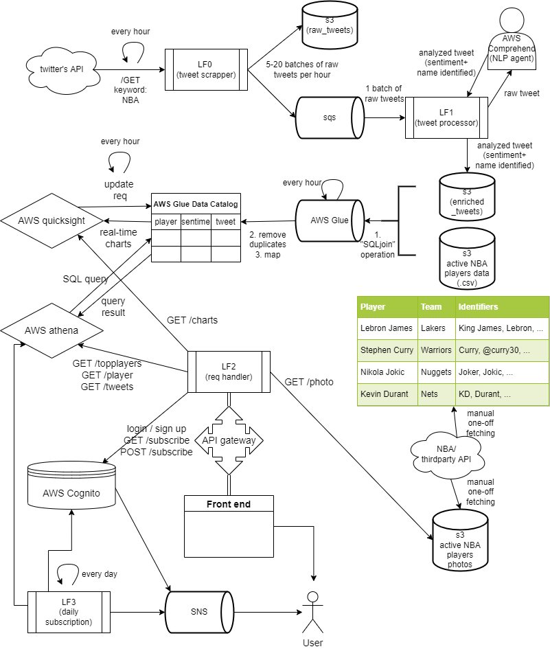

# NBA Players Tweets Sentiment Real-time Analytics
We want to generate and maintain in real-time the lists of the top 3 currently most loved and top 3 currently most hated NBA players on earth\

- As NBA geeks, we want to know which players are currently the fans’ favorites, and which players are currently the most hated player on earth (probably Russell Westbrook right now)
- We sort of know from the news and from our daily conversations with friends. But can we quantify it?
- The list may change frequently, especially during the playoffs. So real-time analytics may be great!
- We want to see from the fans’ perspective. Number of fan tweets and their sentiment are our metrics. Players’ game stats are not our concern.

## Endpoints
### 1. /GET topplayers (params: count(optional)=3, sentiment(optional)='NETURAL|POSITIVE|NEGATIVE', interval(optional)=24)\
Note: interval is in number of hours (e.g. 1,24,24*7)\
Example:
```bash
GET https://sgc0m5do03.execute-api.us-east-1.amazonaws.com/dev/topplayers?interval=24&count=3
```
Response:
```json
[{"player_full_name": "Joel Embiid", "count": "233", "ranking": "1", "past_count": "584", "past_ranking": "5"}, {"player_full_name": "LeBron James", "count": "159", "ranking": "2", "past_count": "1115", "past_ranking": "1"}, {"player_full_name": "Paul George", "count": "138", "ranking": "3", "past_count": "14", "past_ranking": "86"}]
```
### 2. /GET playerv2 (params: fullname="")\
Example: 
```bash
GET https://sgc0m5do03.execute-api.us-east-1.amazonaws.com/dev/playerv2?fullname=Trae%20Young
```
Response:
```json
[{"interval": "week", "sentiment": "positive", "player_full_name": "Trae Young", "count": "5", "ranking": "12", "past_count": "11", "past_ranking": "5"}, {"interval": "week", "sentiment": "all", "player_full_name": "Trae Young", "count": "45", "ranking": "14", "past_count": "92", "past_ranking": "6"}, {"interval": "day", "sentiment": "positive", "player_full_name": "Trae Young", "count": "5", "ranking": "12", "past_count": null, "past_ranking": null}, {"interval": "day", "sentiment": "negative", "player_full_name": "Trae Young", "count": "13", "ranking": "9", "past_count": null, "past_ranking": null}, {"interval": "week", "sentiment": "negative", "player_full_name": "Trae Young", "count": "13", "ranking": "9", "past_count": "10", "past_ranking": "6"}, {"interval": "day", "sentiment": "all", "player_full_name": "Trae Young", "count": "45", "ranking": "14", "past_count": null, "past_ranking": null}]
```

### 3. /GET tweets (params: fullname="", count(optional)=3, start(optional)=24, end(optional)=0)\
Note: start/end are the number of hours from the current timestamp\
count represents the num of tweets you want *for each* of the 3 sentiments\
Example: 
```bash
GET https://sgc0m5do03.execute-api.us-east-1.amazonaws.com/dev/tweets?fullname=Trae%20Young&count=1
```
Response:
```json
[{"tweet_id": "1515099645764112386", "tweet_text": "\ud83d\udd25FD Odds Boost\ud83d\udd25\n\nI\u2019m really liking the value on both of these odds boosts! Garland has been on fire and Young is do for a bounce back game. \n\n#NBA #NBApicks #BasketballPicks #FreePicks #SportsBetting #SportsPicks #Betting #WinningPicks #GamblingTwitter #bettingtwitter https://t.co/5m3YYDu8F8", "sentiment": "POSITIVE", "created_at": "2022-04-15 22:47:59.000", "player_full_name": "Trae Young"}, {"tweet_id": "1515098758526214147", "tweet_text": "Picks for tonight: \nDarius Garland over 42 fantasy score\nBrandon Ingram over 23.5 points\nKevin Love over 7 rebounds\nTrae Young over 29.5 points\nCan also play Embiid .5 points if you haven\u2019t yet\n\n#nba #GamblingTwitter #nbabets #PrizePicks #nbaprops", "sentiment": "NEUTRAL", "created_at": "2022-04-15 22:44:27.000", "player_full_name": "Trae Young"}, {"tweet_id": "1515090073691193344", "tweet_text": "@IcecxldTony @Clippersia @LegendOfWinning Trae is the worst defender in the league PG13 is a consistent all nba defensive team level defender and a better shooter then Trae", "sentiment": "NEGATIVE", "created_at": "2022-04-15 22:09:57.000", "player_full_name": "Trae Young"}]
```
### 4. /GET charts
Note: The "EmbedUrl" field in the response body are the charts\
Example: 
```bash
GET https://sgc0m5do03.execute-api.us-east-1.amazonaws.com/dev/charts
```
Response:
```json
{"ResponseMetadata": {"RequestId": "67110bd0-b849-410e-b76e-be9f23e1d437", "HTTPStatusCode": 200, "HTTPHeaders": {"date": "Wed, 27 Apr 2022 18:56:23 GMT", "content-type": "application/json", "content-length": "1050", "connection": "keep-alive", "x-amzn-requestid": "67110bd0-b849-410e-b76e-be9f23e1d437"}, "RetryAttempts": 0}, "Status": 200, "EmbedUrl": "https://us-east-1.quicksight.aws.amazon.com/embed/2bce86dc541b42ae862ed56a6e1b3fd7/dashboards/6ccb3230-44ce-4c47-af10-ae80c12bd1fc?code=AYABePmKSmoiybgUX2WNUWgnt8kAAAABAAdhd3Mta21zAEthcm46YXdzOmttczp1cy1lYXN0LTE6MjU5NDgwNDYyMTMyOmtleS81NGYwMjdiYy03MDJhLTQxY2YtYmViNS0xNDViOTExNzFkYzMAuAECAQB4EeOLgrUr51nsHbjCawUUKjOqEm284CNxqOjvtm6TGiwBvsw5Yp3Tj9GiOQRSPESBUgAAAH4wfAYJKoZIhvcNAQcGoG8wbQIBADBoBgkqhkiG9w0BBwEwHgYJYIZIAWUDBAEuMBEEDGfAu5wXgkwVkTSuhwIBEIA7_3u0qIAib9yak3xjmEJfsgBUUA_xwEe3lKS-vbEgYGMD5VlFicURTodn-HivpZISUgby_EEJFwlUC9ECAAAAAAwAABAAAAAAAAAAAAAAAAAA753TwOou0hexFjEP8u2LFf____8AAAABAAAAAAAAAAAAAAABAAAA5fQZQiNrJIodzYnEJz4h0cN4S5RxVsTelUt8KwVQJCOnOExryciFIO97qvz78R0HqxtCSK3jaQOQt67ZCpc6fB4Fc7IMriqAa9y4nBSSeRTljLSTy9nfS3T4AcMdAtO65W_VD_uaEvy_KRfY-LqttPcJdmLUTdq7rVTPw9aFI5j6o_pinI30GHsLiCXHSi4Mg9yU2umc9vcGhc7CoRG6gvp-NHZjAauyaL7suZcda4B6X8SbaJXZyIj-VurFR51SepIB5AfzGk65S869G1Q_im_CPykbCyUQdDg4vGHHy7-XTBh_ZO2tWKe40D1nUn1ZIqqBsU-F&identityprovider=quicksight&isauthcode=true", "RequestId": "67110bd0-b849-410e-b76e-be9f23e1d437"}
```
### 5. /POST subscribe (body: { user:"email", players:"Fullname"})
```bash
POST https://sgc0m5do03.execute-api.us-east-1.amazonaws.com/dev/subscribe
{
    "email":"markyamhs@gmail.com",
    "player":"Ja Morant"
}
```
Response:
```json
{
    "SubscriptionArn": "pending confirmation",
    "ResponseMetadata": {
        "RequestId": "4772efe4-0695-5274-bb9c-b507f0f53fc2",
        "HTTPStatusCode": 200,
        "HTTPHeaders": {
            "x-amzn-requestid": "4772efe4-0695-5274-bb9c-b507f0f53fc2",
            "content-type": "text/xml",
            "content-length": "298",
            "date": "Thu, 28 Apr 2022 01:55:44 GMT"
        },
        "RetryAttempts": 0
    }
}
```
### 6. /GET subscribe (params: username="")
```bash
GET https://sgc0m5do03.execute-api.us-east-1.amazonaws.com/dev/subscribe?username=markyamhs@gmail.com
```
Response:
```json
["Chris Paul", "Giannis Antetokounmpo", "Lebron James"]
```
### 7. (Not used) /GET player (params: fullname="", starttime(optional)=24, endtime(optional)=0)\
Note: starttime/endtime are the number of hours from the current timestamp\
Example: 
```bash
https://sgc0m5do03.execute-api.us-east-1.amazonaws.com/dev/player?fullname=Trae%20Young&starttime=1000&endtime=0
```
Response:
```json
{"ALL": [{"player_full_name": "Trae Young", "count": "92", "ranking": "6"}], "POSITIVE": [{"player_full_name": "Trae Young", "count": "11", "ranking": "5"}], "NEGATIVE": [{"player_full_name": "Trae Young", "count": "10", "ranking": "6"}], "NEUTRAL": [{"player_full_name": "Trae Young", "count": "68", "ranking": "6"}]}
```

## TO DO (Everyone please update here from time to time)
1. Set up and integrate AWS Cognito with the front end (assigned to ?)
2. NBA data scraping (assigned to Joy)
- Create a more comprehensive table for the current NBA players. One-off manual effort is needed
- Currently only 2 columns (Fullname, Nicknames), we need (Fullname, Nicknames, PhotoS3Url, Team)
- Third-party NBA API may be helpful
- Need to identify more nicknames (refer to ./nba_data/nba player.csv)
- Need to map players to team (we want only active players) 
- Need to download & store players' photos in S3. The most popular 30~50 will suffice. 
- Expose /GET photo (params: fullname="") which returns the S3Url for the photo of a specific player. The frontend will need it.
3. Front end (assigned to Dhruvin)
- Frontend integrate AWS Cognito for login/signup (assigned to Dhruvin. Half-way done, contact Mark for more details)
- Mark has already written some code for the frontend in React. Check the front-end github repo for reference.
4. Design email message for user subscription (assigned to ?)
- We have the json result from GET /playerv2 but need to translate that into human readable paragraphs before publishing via SNS.
- See LF3

## Features
- Top 3 most liked players of the day/month
- Top 3 most hated players of the day/month
- See some of the recent tweets of the current top 3 most liked/hated players
- Past trends
- Find your player’s popularity ranking
- Subscribe to daily report about your favorite player

## Contributing
-Ho Shing Yam, Mark (hy2287@nyu.edu)

## System Design Diagram


## Links
[Front-end](https://nyu-final-proj-front-end.s3.amazonaws.com/index.html)\
[Prototype](https://marvelapp.com/prototype/7f6c532/screen/85969524)\
[Proposal](https://docs.google.com/document/d/1wvxu2ikUTOj7Iv4xydZlQcTS5IZ8J3_aaN4Ehx_FBcE/edit)\
